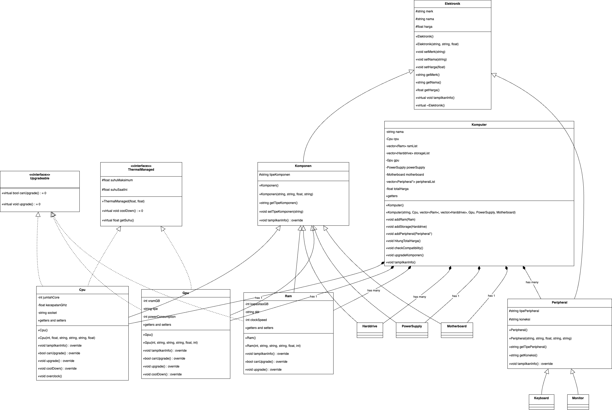

## Project Overview

This project demonstrates a comprehensive object-oriented design for a computer system implemented across three programming languages: C++, Python, and Java. The goal is to showcase object-oriented programming principles, inheritance, and composition using different language paradigms.

## Diagram


## Language Implementations

### 1. C++ Implementation
- Strong typing and manual memory management
- Uses class-based inheritance
- Implements virtual functions for polymorphism
- Demonstrates low-level object-oriented programming

### 2. Python Implementation
- Dynamic typing
- Uses more flexible object-oriented approach
- Leverages Python's multiple inheritance
- Demonstrates pythonic OOP principles

### 3. Java Implementation
- Strongly typed language
- Explicit interface definitions
- Compile-time type checking
- Strict object-oriented design

## Common Design Principles Across Implementations

### Core Concepts
- Inheritance Hierarchy
- Composition Relationships
- Component-Based Computer System Design
- Upgradeable Components
- Thermal Management

## Class Hierarchy Structure

### Base Classes
- Electronic (Base class for all components)
- Component (Specialized electronic components)
- Peripheral (Input/output devices)

### Interfaces
- Upgradeable (Performance upgrade capability)
- ThermalManaged (Temperature management)

### Key Components
- CPU
- GPU
- Motherboard
- RAM
- Storage Devices
- Power Supply
- Peripherals (Keyboard, Monitor)

## Comparative Language Analysis

### Inheritance Implementation
- **C++**: Multiple inheritance with virtual base classes
- **Python**: Multiple inheritance with method resolution order
- **Java**: Single inheritance with interface implementation

### Composition Strategy
- **C++**: Pointer and reference-based composition
- **Python**: Flexible object aggregation
- **Java**: Strong type-checked composition

### Upgrade Mechanism
- **C++**: Template-based generic upgrades
- **Python**: Dynamic method modification
- **Java**: Interface-based upgrade strategy

## Shared Implementation Goals

1. Create a flexible computer system model
2. Demonstrate object-oriented design principles
3. Implement component upgrade and management
4. Provide detailed system information display

## Recommended Cross-Language Improvements

1. Standardize interface definitions
2. Create a common design pattern
3. Implement cross-language serialization
4. Develop comprehensive compatibility checks

## Language-Specific Challenges

- **C++**: Manual memory management
- **Python**: Dynamic typing limitations
- **Java**: Verbose type declarations

## Potential Extensions

1. Add more advanced thermal management
2. Implement detailed compatibility checking
3. Create a configuration validation system
4. Develop comprehensive logging mechanisms

## Inheritance vs Composition Visualization

```
Base Electronic
│
├── Components
│   ├── CPU
│   ├── GPU
│   ├── RAM
│   └── ...
│
└── Peripherals
    ├── Keyboard
    └── Monitor
```